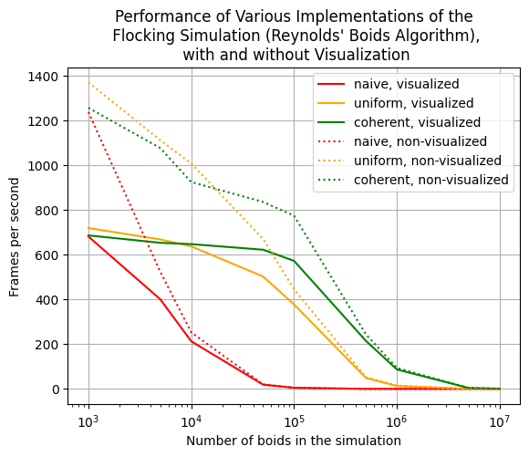
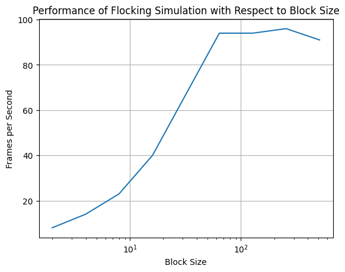

**University of Pennsylvania, CIS 5650: GPU Programming and Architecture,
Project 1 - Flocking**

* Rebecca Feng
  * = [LinkedIn](https://www.linkedin.com/in/beckyfeng0803/), [personal website](https://beckyfeng08.github.io/)
Tested on: Windows 11, AMD Ryzen 9 @ 2.50 GHz 8GB, GTX 5060

I implemented the flocking simulation in three different ways: one, the naive method, where I check each boid against all the other boids in the grid when calculating the velocity update, two, the uniform grid method, where I divide the grid into individual grid cells and compare each boid against the neighborhood of cells that surround it, and three, the coherent uniform grid method where, in addition, I remove an intermediate buffer to find boid positions and velocities, and also exploit the benefits of the cache in terms of accessing memory neighboring each other when getting neighboring boids' position and velocity data.

- As you can see below, overall the greater the number of boids in our simulation, the slower our program is. I measured this by comparing the number of boids in our simulation against frames per second, where I average of the fps starting 5 seconds into the simulation, for 10 seconds (in order to throw out any values of the FPS associated with the starting up of the program).
    - Furthermore, the naive method does relatively poorly across the other two methods, while the coherent uniform grid does the best. I also turn off rendering particles onto the screen in order to display the raw performance of our program, not confounded or lagged by the performance of rendering onto our screen, as indicated by the dotted lines in the graph.

    - The reason why a larger number of boids affect our performance is due to there being more computation in order to check one boid against all other boids, whether in immediate neighborhoods (uniform, coherent uniform), or across all boids (naive).

- I also changed the block size and measured the performance of our program with respect to it, as shown in the graph below. The graph below specifically outlines the performance of the program when using the coherent uniform method with 1,000,000 boids.

 - The program starts to plateau out at 64 blocks. Since I assign a thread corresponding to each boid, more blocks will result in more threads allocated to the program, which become unnecessary as one thread is only assigned to one boid at a time. However, before the plateauing, you can see a steep increase in performance, because more threads are assigned to carry out computation for each boid, simulataenously.

- I saw that the coherent uniform grid gave us a boost in performance, as expected, because I was able to cut out our dev_particleArrayIndices data structure and access our position and velocity data directly, which were preprocessed so that the data would be right next to each other in memeory and therefore faster for our computer to access due to cacheing.
- I also experimented with changing the cell width and checking for 27 vs 8 neighboring cells, and how that overall affects our performance. Checking 27 neighbors is actually faster than checking 8 neighbors. This is largely due to the preprocessing necessary to check which neighboring 8 cells must be compared with, witht he boid in questions whereas that computation isn't necessary when checking across all 27 enighboring cells.
